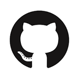
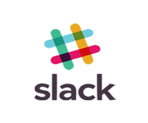

:lang: no
:doctitle: Om plattformen
:keywords: Github, asciidoc, archi, slack

include::../na__felles/includes/commonincludes.adoc[]

[.lead]
Plattform for samproduksjon og deling av arkitekturdokumentasjon, tilrettelagt av Difi.

image:../na__felles/images/i-arbeid.png[width=75, height=75] I arbeid

:numbered:

////
////

== Introduksjon 

Plattformen består av 

image:./images/googledrive-logo.png[width=100, height=100]
image:./images/archi-logo.png[width=180, height=180]

image:./images/asciidoctor-logo.png[width=80, height=80]

== Annen informasjon

////

